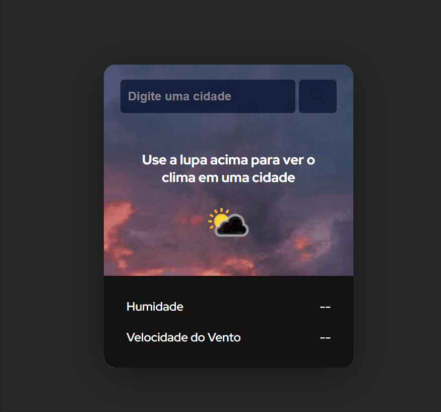

 # Aplicativo de visualização do clima atual

Um projeto realizado na live Black em Dobro ! 🚀 

## Desafios do projeto

O meu maior desafio ao realizar esse projeto foi a parte de puxar uma API, até esse momento não estou muito familiarizado com JavaScript então a parte do código do JS tive uma certa dificuldade. Com o auxílio da live consegui realizá-lo de maneira correta, como proposto na live.

## Tecnologias utilizadas

- HTML
- CSS
- JavaScript
- API (FreeWeather API)

## Como utilizar

Simplesmente coloque sua cidade, ou cidade que deseja saber a atual condição climática e clique na lupa.
